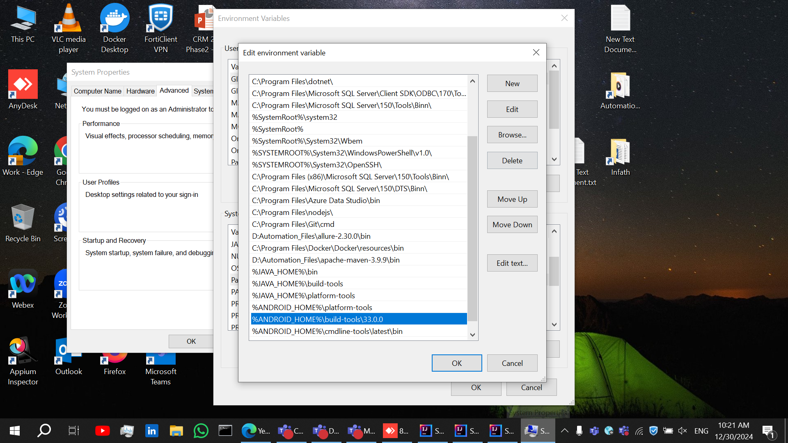

## Overview
- Test Automation Project for PetroApp with Selenium And RestAssured written by Java and based on Maven
- Using My Own Test Automation Engine as Testing Framework, Check Engine Details https://github.com/YehiaMetwally95/YehiaEngine
- Using TestNG as the Testing Framework
- Used Design Patterns:
  - Using Fluent Page Object Model Design Pattern in writing UI Test script and Page actions, thus chaining the Scenario steps and validations in one line of code
  - Using Fluent Object Model Design Pattern in writing API Test scripts, thus chaining the Scenario steps and validations in one line of code
  - Using Object Model Design by setting two Object Model Classes for Request and Response of every Endpoint such that:
      - Request Object Model Class that contains all methods performed on Request Parameters through Request Pojo Class, includes Preparing Request body with static or dynamic data and Executing the Request
      - Response Object Model Class that contains all Validations and Getters performed on the Response Parameters through Response Pojo Class
  - Using Pojo Classes for storing all Request and Response Parameters for every Endpoint with the help of Jackson Library for deserializing Json Payloads into Pojo Classes
  - Using Lombok Library for generating Setters, Getters & Constructors & ToString of All Pojo Classes, thus reduce Boiler plate Code
  - Builder Pattern for Constructing Request Pojo Class with input parameters step by step in fluent manner to build the Request Body
  
- Test Data Management such that store All Test data in Json File for each Test Class
- Generating Very Detailed Allure Reports with All Scenario Steps And Screenshots for Passed/Hard-Assertion-Failed/Soft-Assertion-Failed Tests and for API Requests and Responses
- Perform Test Execution On Local / Headless / Remotely using Selenium Grid with Docker Containers
- Performing Parallel Execution from CI/CD Pipeline with GitHub Actions, Supplied by Selenium Grid with Docker, To Run Parallel Tests at same time, thus Reducing Execution time
- Bypassing API Login in API tests, Thus Reducing Execution time and Dependency of Login before each Request Sent
- Using Advanced Techniques to Locate Web Elements like XPath Axis

## Application Under Test
- Website --> https://hiring.petroapp.com/test2.html
- API --> http://hiring.petroapp.com/api.php?endpoint=authenticate

## Features
#### Structure of "test folder"
- Using Base Test Class for defining Annotations to Open and Close App, such that all Test Classes inherit from it
- Start each Test from a clean state by Setting and Tearing down App for Every Test Case
- "Using Assertions as follows:
    - All Assertions are implemented in Page Class (UI Tests) or in Object Model Class (API Tests) to allow the Fluency of Scenarios Steps with Validations like (Navigate.Writesteps..SoftAssertions.HardAssertions)
    - Using Hard assertions & Soft assertions for doing verifications within the test

#### Test Data Management
- Reading Global Variables and Configurations from Properties file, like selecting browser type, execution type, setting capabilities of every browser like headless execution , Set Parallel Modes
- Test Data Preparation for Static Data like "UserCredentials, Page Headers, ApiResponseCodes,Car Details" by Filling it Manually on Json Files for every Test & User this data for Validations
- Test Data Generation for Fuel Record Inputs like in "CreateNewRecord" using Time Stamp for Unique values & Data faker for more Descriptive values
- Test Data Execution by reading test data from Json files whether Json data is represend as Simple Json Object or Array of Json Objects

#### Create CI/CD Pipeline with GitHub Actions
- Workflow that run API Tests Remotely In Parallel
  - Check Generated Allure Report from this link https://drive.google.com/drive/folders/18GAlea8un83F6UAWodqvMiLZAxIj4jmV?usp=sharing
- Workflow that run UI Tests Remotely In Parallel Across Different Browsers, Check Allure Report from below link
  - Check Generated Allure Report from this link 
- Workflow that run All Tests Remotely In Sequence
  - Check Generated Allure Report from this link https://drive.google.com/drive/folders/1r_usZRxIdsiOelBKLoRgn4FQb0aWvbDc?usp=sharing
- Run Workflows on Different Triggers: after every Push, after every Pull Request and Manually
- Generate the Allure Reports after every Workflow run such that
    - Separate Reports for Tests related to a Single Job
    - Combined Report that Include All Tests that runs on all Jobs

## Installation
##### 1- Download Allure Report from here https://github.com/allure-framework/allure2/releases
##### 2- Download Docker from here https://docs.docker.com/desktop/setup/install/windows-install/
##### 3- Download Apache Maven from here https://maven.apache.org/download.cgi
##### 4- Add All bin Directories of Allure , Docker & Maven in Environmental Variables like the below screen 
##### 5- Docker Must be Run on your machine
##### 6 To Setup Selenium Grid with Docker Container in order to Run Tests Remotely, Just run the following command in Intellij Terminal
```bash
docker compose -f src/main/resources/dockerFiles/docker-compose-grid-v3.yml up --scale chrome=2 --scale edge=0 --scale firefox=0 -d 
```
##### 7- After The Setup, To be Able to Run Remotely, The flags "executionType" & "isHeadless" in Configuration.properties shall be set with "Remote" & "true"
##### 8- After Finish the Test Execution, Its Better to CleanUp and Stop running the Docker Containers by running the following command in Terminal
```bash
docker compose -f src/main/resources/dockerFiles/docker-compose-grid-v3.yml down
```  